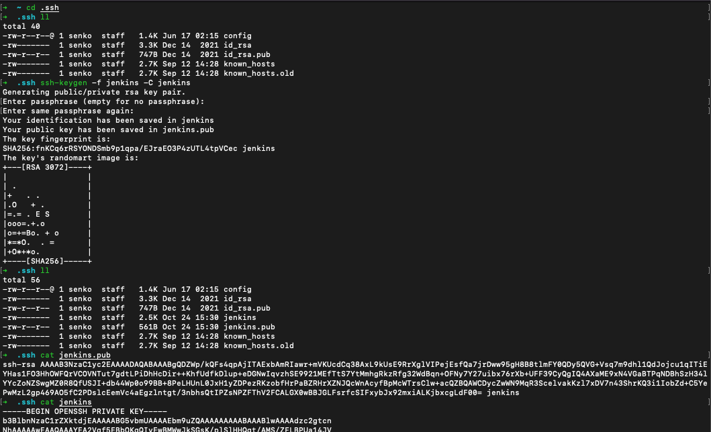
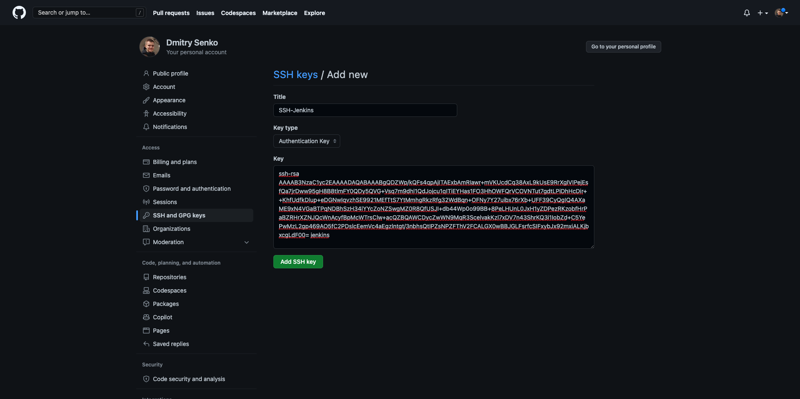
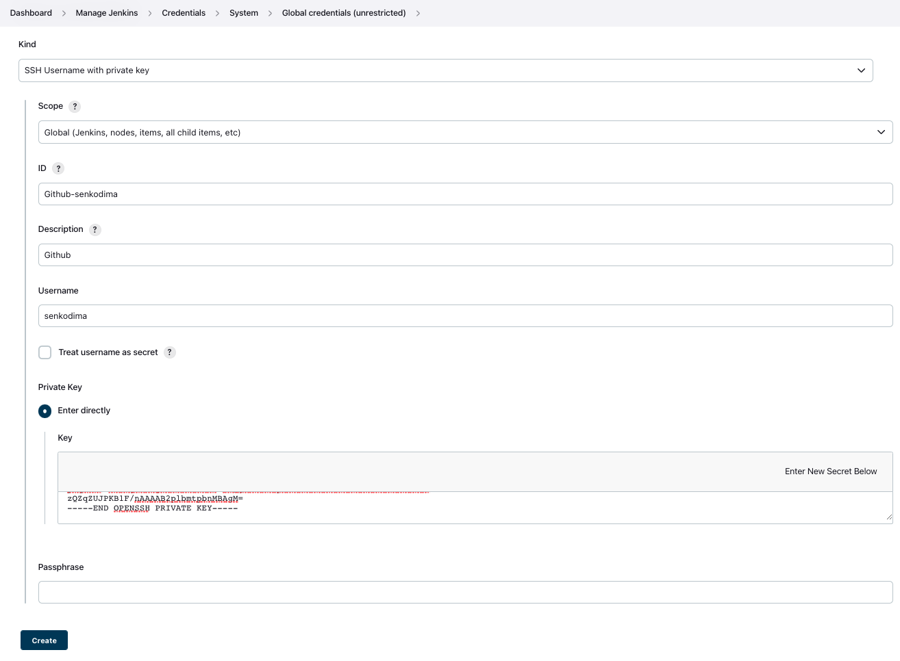
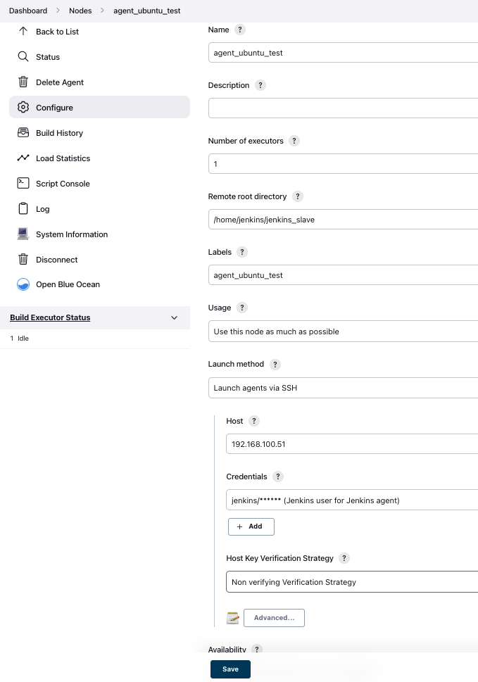
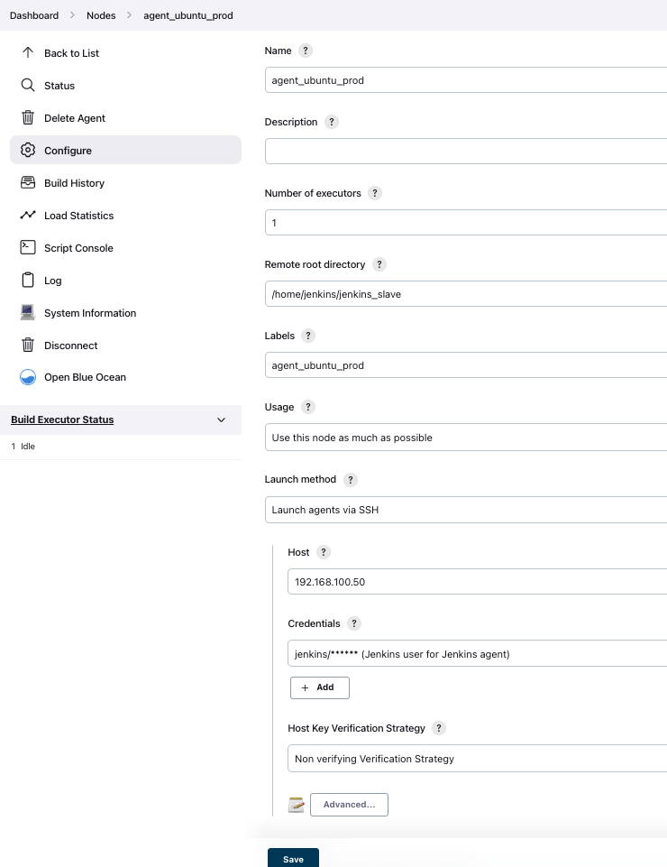
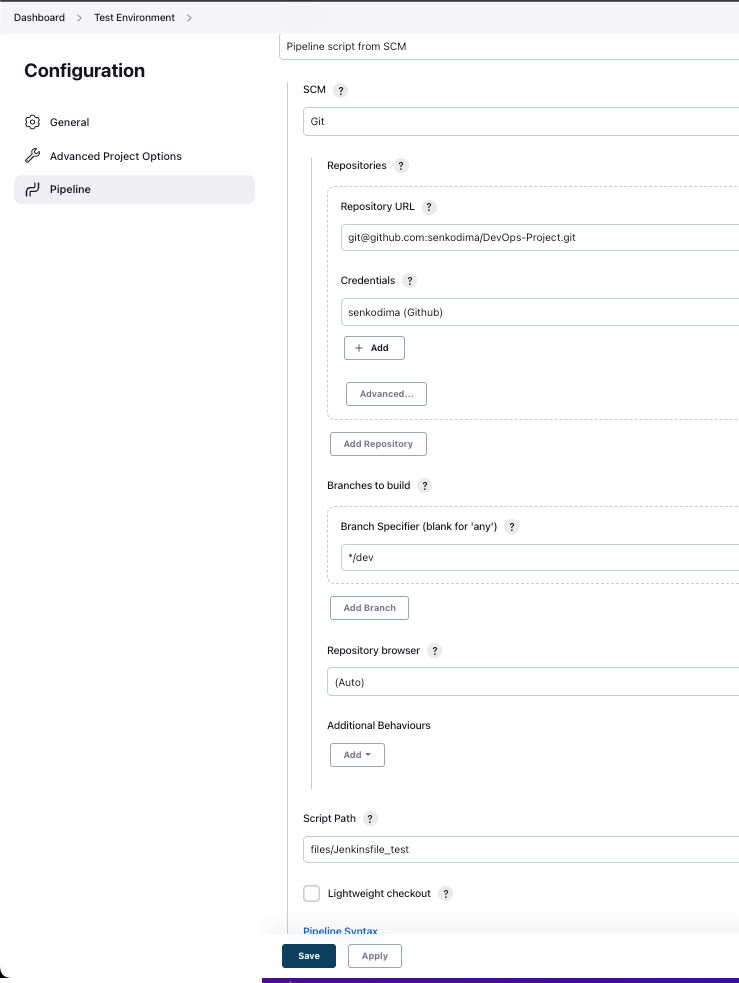
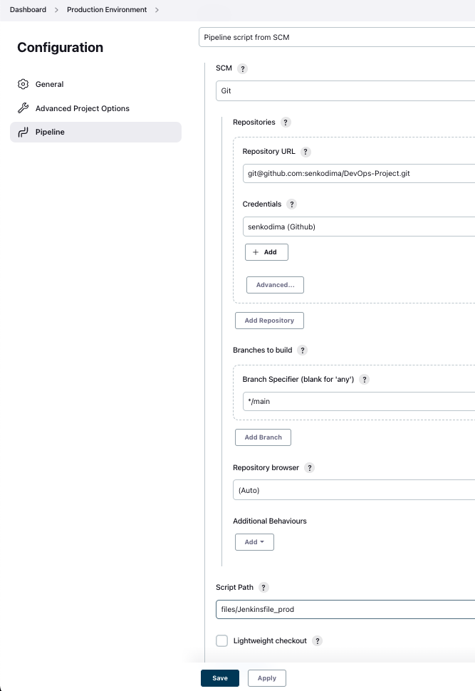

# DevOps-Project

```
ТРЕБОВАНИЯ К ДИПЛОМНОМУ ПРОЕКТУ

В дипломном проекте должно быть реализовано:
• выбран общедоступный репозиторий или несколько репозиториев с исходным кодом приложения, состоящего из одного или нескольких микросервисов;
• выполнен fork или сделана копия репозитория;
• автоматизировано создание инфраструктуры для развертывания проекта;
• автоматизированы процессы CI/CD;
• настроен мониторинг инфраструктуры и приложения.

Критерии выполнения:
• Репозитории должен содержать минимальную документацию, описывающую содержимое и процессы сборки и развертывания;
• Инфраструктура должна разворачиваться с нуля запуском одной команды. Все должно быть реализовано по принципам IaC;
• CI/CD:
    o при коммите в любую ветку репозитория должны запускаться этапы проверки кода линтером, сборки исходного кода, автотесты собранного приложения и загрузка артефактов в хранилище;
    o при коммите в основную ветку (master/main) дополнительно должен запускаться автоматический deployment на целевую инфраструктуру;
    o Должно отправляться уведомление о результате сборки и развертывания в любой канал (почта, чат).

Дополнительные (опциональные) варианты улучшения проекта:
• Реализация SSL/TLS;
• Масштабируемость (несколько реплик одного сервиса с балансировщиком);
• Контейнеризация;
• Kubernetes в качестве целевой инфраструктуры;
• Больше типов и количества тестов (интеграционное, нагрузочное и пр.);
• Автоматическая настройка всего (включая CI\CD, мониторинг) с нуля;
• Мониторинг инфраструктуры и приложения;
• Реализация Log-aggregation;
• Документированный код.

Применяемые инструменты:
• Развертывание инфраструктуры: Terraform, AWS, EKS, Ansible, Docker, Vagrant;
• CI/CD: Jenkins, Github Actions;
• Оповещение: Email, Telegram, Slack, Discord;
• Мониторинг: Prometheus, Grafana;
• Логирование: ELK.

Защита проекта:
• Краткая презентация с описанием проекта, примененными инструментами, проделанной работы и полученными результатами (3-5 мин.);
• Демонстрация CI/CD (10-12 мин.);
• Вопросы и обсуждение (5-7 мин.).

Примеры репозиториев приложений:
• Golang Hello World
https://github.com/hackersandslackers/golang-helloworld
• Sample app maven
https://github.com/jenkins-docs/simple-java-maven-app
• Sample app gradle
https://github.com/jitpack/gradle-simple
https://github.com/jhipster/jhipster-sample-app-gradle
• Calculator App
https://github.com/HouariZegai/Calculator
```

```
Дата выпускного занятия (защита дипломных проектов) установлена на 26.12.2022 (понедельник) в 18.30 онлайн.

Проекты должны быть сданы на проверку преподавателю заранее❗️❗️

Сертификаты выдаются при наличии дипломного проекта (соответствующего требованиям преподавателя) и успешной его защите‼️
Выпускникам онлайн формы обучения, выдается электронный сертификат❗️❗️

Порядок проведения выпускного занятия (на каждого человека ориентировочно выделяется 10 минут (групповой проект 15-20 минут)) :
1. Презентация проекта
1.1 Студент (группа студентов) представляются "Меня(нас) зовут ****"
1.2 Презентация самого проекта на экране.
1.3 За время написания диплома столкнулся с такими сложностями, как...
1.4 Планирую усовершенствовать и добавить ....
2. Студент (группа студентов) отвечают на вопросы от преподавателя/одногруппников.
3. Подведение итогов😊
```

## Example of creating ansible roles
```bash
cd files/for_ansible/roles/
ansible-galaxy init common
ansible-galaxy init install_docker
ansible-galaxy init install_java
ansible-galaxy init jenkins_user
ansible-galaxy init telegram_notification
```

## Initial steps for environment configuration

### 1) Edit `vagrant_config.yaml` in `files/for_vagrant/`:

```yaml
machines:
  HW_number: Final

  timezone: "Europe/Minsk"
  bridge_name: "en0: Wi-Fi"
  network_type: "public_network"

  ubuntu_prod:
    ip: "192.168.100.50"
    vagrant_name: "ubuntu_prod"
    box: "generic/ubuntu2004"
    hostname: "HW-{HW_number}-Ubuntu-Prod"
    mem: 512
    cpu: 1

...
...
...

ubuntu_test:
    ip: "192.168.100.51"
    vagrant_name: "ubuntu_test"
    box: "generic/ubuntu2004"
    hostname: "HW-{HW_number}-Ubuntu-Test"
    mem: 512
    cpu: 1
```
This `vagrant_config.yaml` used for creating ansible `inventory.yaml`

### 2) Make `full_init.sh` script executable:
```bash
chmod +x files/full_init.sh
```

### 3) Create two telegram bots:
   - For Ansible playbook 
   - For Jenkins pipeline
   
Example of creating telegram bot and get chat where to send messages:
```
1) Create new telegram bot in @BotFather.
   Get HTTP API bot token.
2) Create a new channel.
   Add a newly created bot with admin rights to it, it is necessary to publish new messages.
3) Get the chat ID to send notifications. 
   For this replace '<TOKEN>' as your HTTP API token. 
   Go to the https://api.telegram.org/bot<TOKEN>/getUpdates and get 'chat.id' value for channel
   (for channel chat, keep the sign '-' in front of the number, this is the full identifier)
```

### 4) Create Ansible Vault

- For success ansible telegram notification create two variables in ansible vault like `telegram_token` and `telegram_chat_id`
- For success running `localhost_playbook.yaml` add `ansible_become_password` with your sudo password for localhost machime

```bash
cd files/for_ansible/
```

To create encrypted Ansible Vault:
```bash
ansible-vault create vault.yml
```

To edit encrypted Ansible Vault:
```bash
ansible-vault edit vault.yml
```

In vault.yml add lines like:
```bash
telegram_token: "9999999:XXXXXXXXXXXXXXXXXXXXXXX"
telegram_chat_id: "1111111111111111"
ansible_become_password: "111111111"
```

---

### Ansible playbook with ansible vault example

To get variables from encrypted Ansible Vault:
```bash
--ask-vault-password --extra-vars '@vault.yml'
# or short form
--ask-vault-pass -e '@vault.yml'
```

Or use file with vault password for encrypted Ansible Vault
```bash
--vault-password-file vault -e '@vault.yml'
# or short form
--vault-pass-file vault -e '@vault.yml'
```

File `vault` contains password like: `123` for encrypted `vault.yml`

Example run ansible playbook with ansible vault
```bash
ansible-playbook -i inventory.yaml --vault-pass-file vault -e '@vault.yml' playbook.yaml
ansible-playbook -i inventory.yaml --vault-pass-file vault -e '@vault.yml' localhost_playbook.yaml
```

---

## Web application

This project uses a web application [Geometry calculator python flask web app](https://github.com/foxster14/geometry_calculator_python_flask_web_app.git) for docker build

Another web application example [Flask Web API](https://github.com/AiswaryaLakshmy/Flask-Web-API) for docker build

---

### Create (on localhost) SSH key for Jenkins master and GitHub


### Add the newly created public SSH key to GitHub


### Add the newly created private SSH key to Jenkins master


### Configure Jenkins agent for test environment


### Configure Jenkins agent for production environment


### Create Jenkins pipeline for test environment


### Create Jenkins pipeline for production environment

